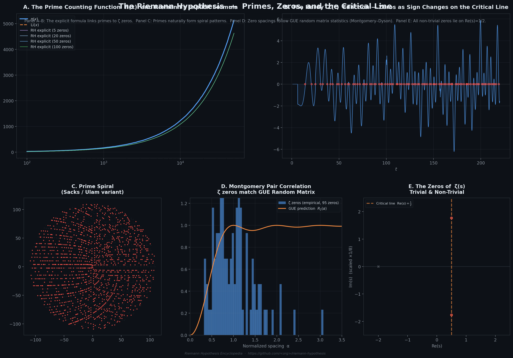

---
difficulty = "★"
keywords = ["preface", "reading-guide", "overview"]
---

# Preface

> Difficulty: ★

*The Riemann Hypothesis — Primes, Zeros, and the Critical Line. Five-panel composite visualization: A. Riemann's explicit formula progressively approximating π(x); B. The Hardy Z(t) function revealing zeros as sign changes on the critical line; C. Prime spiral (Sacks variant); D. Montgomery pair correlation matching GUE random matrix prediction; E. Zeros of ζ(s) — trivial and non-trivial.*

---

## About This Encyclopedia

Welcome to the Riemann Hypothesis Encyclopedia — a systematic introduction to one of mathematics' most celebrated and consequential open problems, from elementary foundations to the frontiers of research.

## Three Reading Paths

This encyclopedia offers three curated paths for readers of different backgrounds:

- 🟢 **Green Path** (History & Humanities): For all readers. Follow Riemann's life and times, the story of prime numbers through history, and the cultural and philosophical impact of the Riemann Hypothesis. Very few formulas.
- 🟡 **Blue Path** (Mathematical Core): For readers with an undergraduate STEM background. Build from complex analysis fundamentals through analytic number theory to the Riemann zeta function and the hypothesis itself.
- 🔴 **Red Path** (Research Depth): For graduate students and researchers. All thirty-two chapters, covering advanced topics and recent developments.

Each chapter is labeled with a difficulty level (★ Foundation / ★★ Intermediate / ★★★ Advanced) and the reading paths it belongs to. Read selectively or cover to cover.

## On Language

This encyclopedia is available in Chinese and English. Both versions are independently authored first-class content — neither is a translation of the other. Some chapters may be available in only one language; each chapter's metadata tracks its translation status.

## Known Limitations

The built-in search engine (elasticlunr.js) does not support Chinese text segmentation, so full-text search of the Chinese edition produces incomplete results. This is a documented limitation for v1. English search works correctly.

## A Living Work

Mathematical research advances, and the story of the Riemann Hypothesis continues to be written. This encyclopedia will be updated to reflect new discoveries, new proof attempts, and new understanding.
