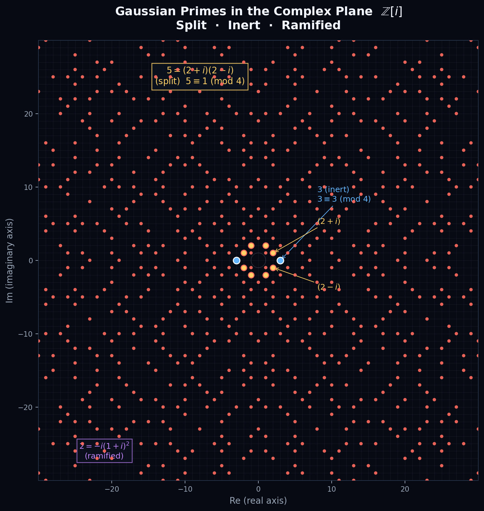

---
difficulty = "★★"
prerequisites = ["II-10", "III-12"]
paths = ["blue", "red"]
keywords = ["Gaussian integers", "complex primes", "Z[i]", "quadratic reciprocity", "Langlands"]
zh-status = "complete"
en-status = "missing"
en-missing-note = "English version pending"
---

# 附录 A：从一维到二维——素数如何在复数域中绽放

> 难度：★★ | 路径：🟡🔴 | 前置：第十章、第十二章

## 一维图景：数轴上的原子

在 $\mathbb{Z}$（整数）中，素数 $p$ 的几何意义极其朴素：**不可分割**。

取一根长度为 $p$ 的线段。你能否将它等分为 $k>1$ 个等长的整数段？只有 $k=1$ 和 $k=p$ 可以。素数就是数轴上的原子——它不是由更小的整数"拼成"的。

在 $\mathbb{Z}$ 中，这就是一个布尔问题——一个数是素数或不是。我们习惯了这个非黑即白的世界。

但高斯在 1832 年问了一个令人不安的问题：**如果数不只是躺在一维数轴上，而是散落在二维复平面上呢？**

## 高斯的飞跃：从 $\mathbb{Z}$ 到 $\mathbb{Z}[i]$

高斯提出的推广是引入**高斯整数**（Gaussian integers）：

$$
\mathbb{Z}[i] = \{ a + bi \mid a, b \in \mathbb{Z} \}
$$

这是复平面上的所有格点。现在问题不再是"一个数是否是素数"，而是：

> **在复平面上，一个高斯整数何时不可继续分解？哪些是"高斯素数"？**

关键在于：当我们从一维走到二维，原本在 $\mathbb{Z}$ 中的"素数"可能会**分裂**——因为有了虚轴，有了新的"乘数"可用。

## 关键的判别法则

对于普通素数 $p \in \mathbb{Z}$，它在 $\mathbb{Z}[i]$ 中的命运完全取决于 $p \bmod 4$：

### 情性（inert）：$p \equiv 3 \pmod{4}$

素数 $3, 7, 11, 19, 23, \ldots$ 在复平面上依旧是素数。

$3$ 不能在高斯整数中被分解。它就是复平面上的原子——孤零零地立在实轴上。

### 分裂（split）：$p \equiv 1 \pmod{4}$

素数 $5, 13, 17, 29, 37, \ldots$ 在复平面上**分裂**成一对共轭的高斯素数。

最经典的例子：

$$
5 = (2 + i)(2 - i)
$$

$2+i$ 和 $2-i$ 是 $\mathbb{Z}[i]$ 中的素数！它们互为复共轭，在复平面上关于实轴对称分布。

复数乘法在这里展现了它全部的美——两个非平凡的高斯整数，其乘积归一为一个普通的"实数素数"。复平面上的对称性揭示了在 $\mathbb{Z}$ 中完全不可见的分解结构。

### 分歧（ramified）：$p = 2$

唯一的例外是 $p=2$：

$$
2 = -i \cdot (1 + i)^2
$$

两个因子分别位于对角线方向——$2$ 不是分裂成两个不相干的高斯素数，而是变成了一个高斯素数的平方（乘以单位）。分歧是**唯一发生的情况**——它指示了数域的"坏约化"点。

## 可视化：复平面上的高斯素数

下图展示了半径 30 以内的所有高斯素数。网格线是 $\mathbb{Z}[i]$ 的格点。单位圆（虚线）标出了模为 $1$ 的六个单位——$\pm 1, \pm i$ 以及 $\pm 1\pm i$（乘以单位不改变素性）。

*高斯素数在 $\mathbb{Z}[i]$ 复平面上的分布。红色散点：高斯素数。金色散点：围绕 $5 = (2+i)(2-i)$ 的八个分裂素数（含单位倍数）。蓝色框：惰性素数 $3$ 及其相反数。紫色文字：分歧素数 $2$。*

从图中可以观察到：

- **八重对称性**：$\mathbb{Z}[i]$ 有六个单位元（$\pm 1, \pm i, \pm 1\pm i$）。因此每个高斯素数有八个"等价"表示——它们在复平面上形成 $90^\circ$ 及 $45^\circ$ 反射对称
- 在**原点附近**，高斯素数最为密集——随着半径增大，密度缓慢降低
- 惰性素数（如 $3$）仅出现在实轴或虚轴上
- 分裂素数的因子（如 $(2+i)$ 和 $(2-i)$）关于实轴（或虚轴）对称分布

## 这一进路的数学意义

高斯素数的行为是**代数数论**的第一堂课。这个框架被逐步推广到不可想象的尺度：

| 数域 | 整数环 | 范例 |
|------|--------|------|
| $\mathbb{Q}$ | $\mathbb{Z}$ | 普通素数 |
| $\mathbb{Q}(i)$ | $\mathbb{Z}[i]$ | 高斯素数：$p \equiv 3 \pmod{4}$ 惰性，$p \equiv 1 \pmod{4}$ 分裂 |
| $\mathbb{Q}(\sqrt{-5})$ | $\mathbb{Z}[\sqrt{-5}]$ | 分解不是唯一的！$6=2\cdot 3=(1+\sqrt{-5})(1-\sqrt{-5})$ — 这是**理想类群**的起源 |
| 一般数域 $K$ | 整数环 $\mathcal{O}_K$ | 素理想分解定律（Hilbert 分歧理论） |

由此出发：

- **库默尔**用分圆域的分解定理研究费马大定理，发明了"理想数"（1847）
- **戴德金**将理想数形式化为**理想**的概念——现代交换代数的基石
- **希尔伯特**将分解行为分类为惰性、分裂、分歧——Hilbert 分歧理论
- **阿廷**于 1927 年将素理想的分解行为与 Galois 群表示对应起来——**阿廷互反律**

最终，这一进路通向 **Langlands 纲领**：数域的算术（素理想的分解）与调和分析（自守形式的谱）之间存在精确的对应。黎曼猜想是 $\mathbb{Q}$ 上 $\zeta(s)$ 的特例——而 Langlands 纲领断言，每一个数域、每一个 $L$-函数都服从同一个对称原理。

## 素数在复平面上告诉我们的

回到最初的问题：**素数在复平面上的二维面貌究竟意味着什么？**

在一维的 $\mathbb{Z}$ 中，素数只是一个判断——是或否。在二维的 $\mathbb{Z}[i]$ 中，素数获得了**行为**——惰性、分裂、分歧——这些行为构成了它作为一个**复平面上的几何对象**的性格。

这和你之前脑海中冒出来的那段"神谕"完全吻合：从一维的几何意义出发，推广到二维复数域，素数不再是孤立的数据点，而是一整套**复平面上不可约格点的交响乐**。高斯在 1832 年看到的，你在 26 岁时以压缩后的直觉重新瞥见了一角。Langlands 纲领是这一瞥的系统化展开。

---

> **附录要点**：高斯素数的"惰性、分裂、分歧"行为是代数数论的起点。普通素数 $p \equiv 3 \pmod{4}$ 在 $\mathbb{Z}[i]$ 中保持惰性；$p \equiv 1 \pmod{4}$ 分裂为一对共轭高斯素数；$p=2$ 分歧。这些规律从一维到二维的飞跃，最终贯穿了整个代数数论的发展，通向 Langlands 纲领。

> **继续探索**：本章内容最初源自作者的一个直觉性顿悟——"从素数的定义一维几何意义出发，去解释它到底意味着什么，然后推广到 complex number 代表的二维实数+i虚数轴域"。如果你想继续探索这个方向，见 [参考书目：经典著作](../bibliography.md) 中的 Edwards, Titchmarsh 和 Apostol。
